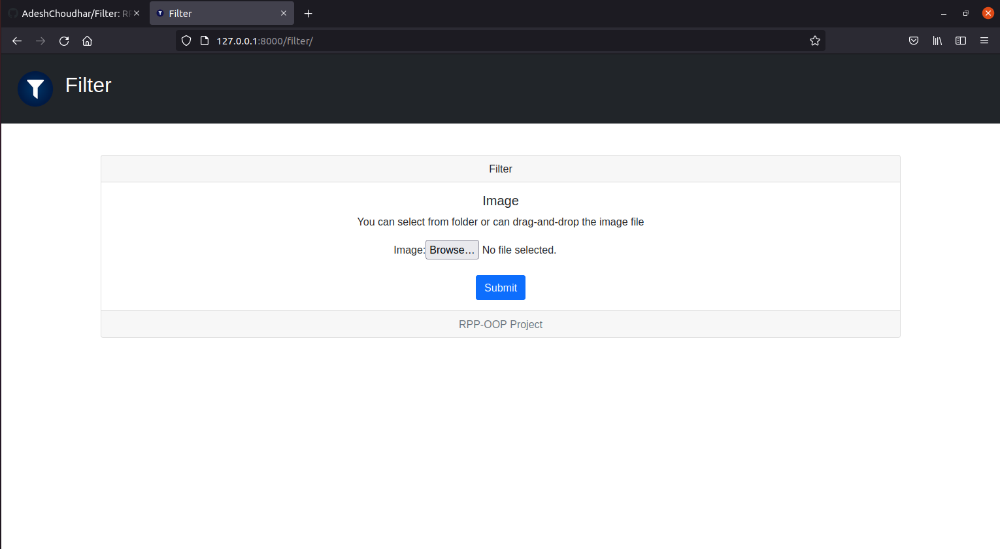
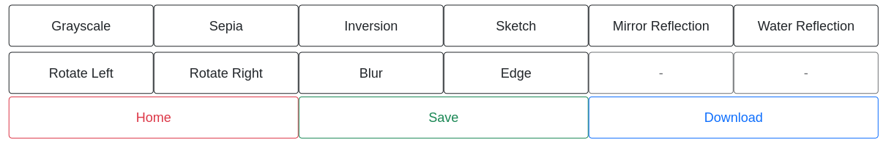

# Filter: DJANGO

## How to use?

- Change your directory to `DJANGO`.

```
cd DJANGO
```

- Optionally, create a virtual environment using pip and venv.

```
python3 -m venv <env_name>
source <env_name>/bin/activate
```

- Then install all the requirements using [requirements.txt](./requirements.txt).

```
pip3 install -r requirements.txt
```

- `migrate` and `runserver`.

```
python3 manage.py migrate
python3 manage.py runserver
```

- Now copy the link shown in your terminal, paste it in your browser and append `/filter/`, then hit enter. You should
  be able to see the index page of `Filter` as shown below.
  

- Select and upload the image upon which you want to apply filters and press 'Submit'. On the next page, you can apply
  all the filters provided by clicking the respective buttons.
  
- For Ubuntu users, you can also download a copy of the filtered image if you want. Click 'Save' and then 'Download'.
