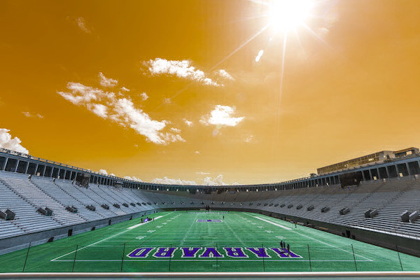
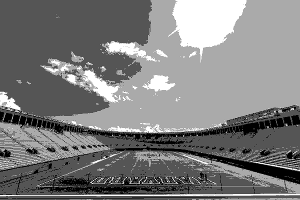
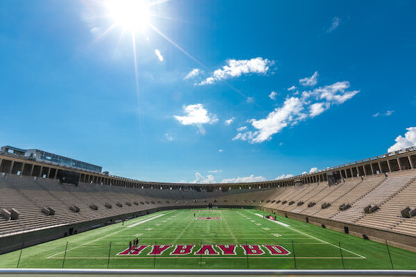
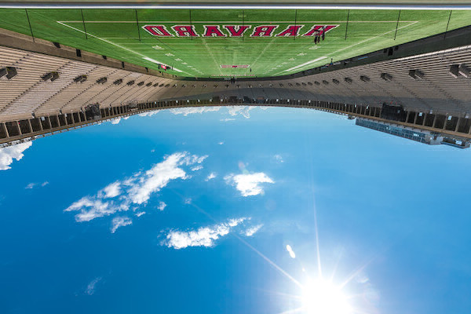
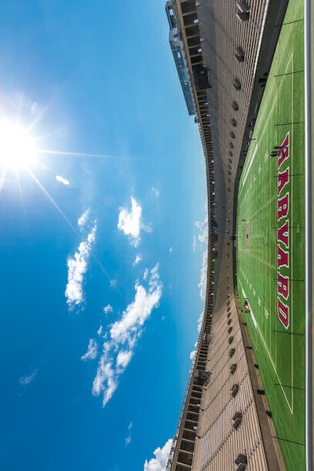
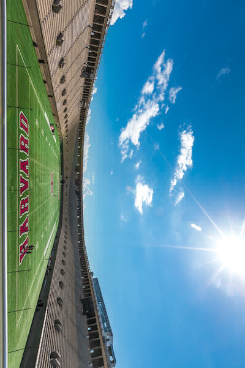
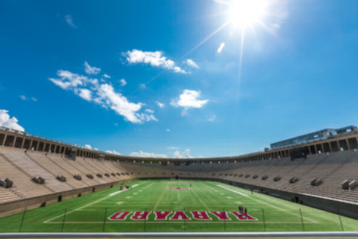
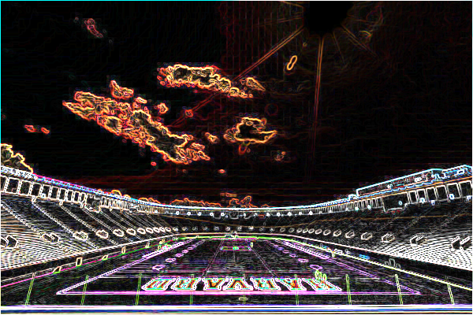

# Filter

## RPP-OOP Mini Project

Filter is a project written in Python. 
It basically inputs an image from the user and apply various kinds of image filtration algorithms and maneuvers on them desired by the user and give us the resulting image. 
This project repository contains all the phases of progress in the way it is being developed.

## Filter images

Input Image

Filters | Output Image
------- | ------------
Grayscale | 
Sepia | 
Colour Inversion | 
Sketch | 
Mirror Reflection | 
Water Reflection | 
Rotate Left | 
Rotate Right | 
Blur | 
Edge | 

## 3 Phases

- [<b>TERMINAL</b>](./TERMINAL): Simple Python application which takes input image and filters through CLAs.
- [<b>OOP</b>](./OOP): 'OOP'ified the TERMINAL application and created a Python library from it. 
- [<b>DJANGO</b>](./DJANGO): A website written using the famous Python framework django.

## PPT

[Filter](./media/Filter.pptx)

## Mentor

Sheetal Rathod Ma'am

## Author

Adesh Shahadeo Choudhar 
MIS: 111903008
