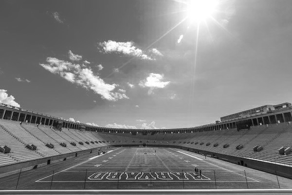
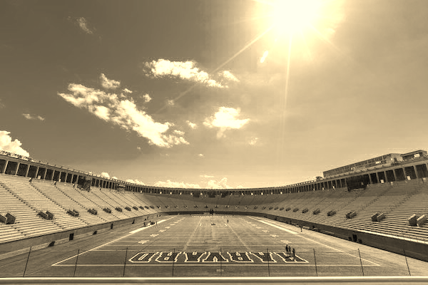
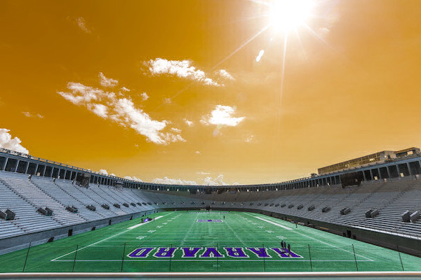
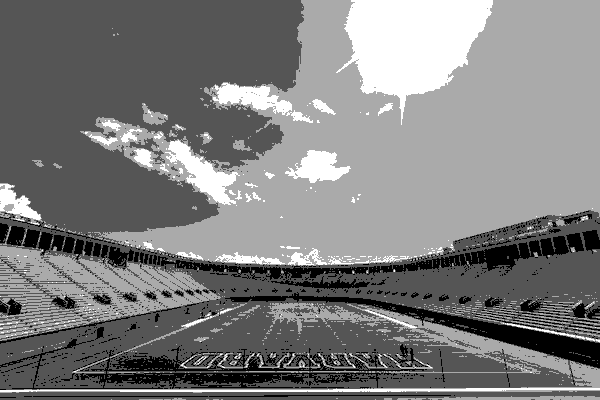
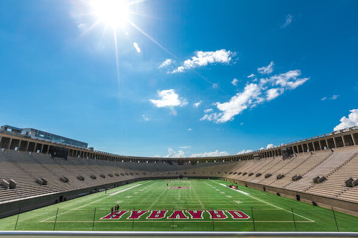
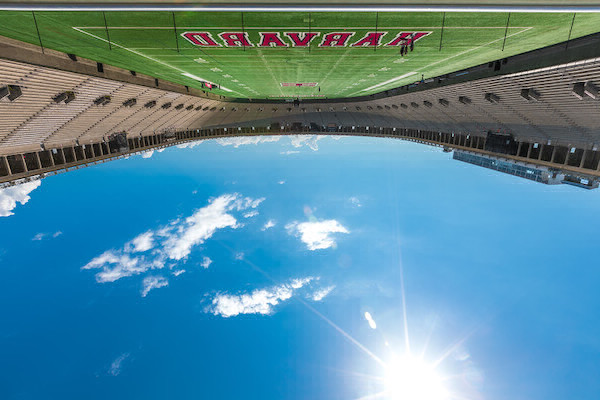
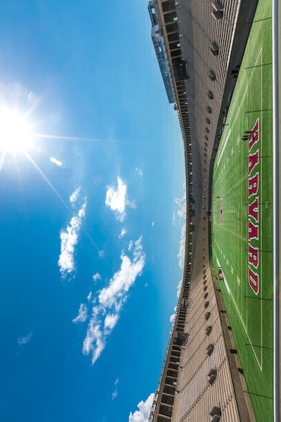
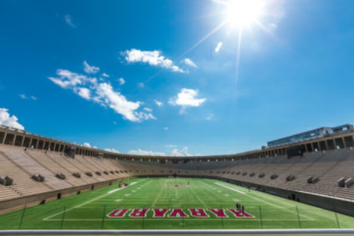
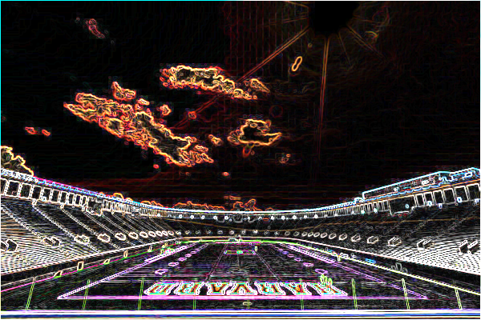

# Filter

## RPP-OOP mini project

Filter is a django application, that uses various algorithms and manipulations applied as a filter on the input image.
This project repository contains all the phases of progress. DJANGO is the latest phase.

## How to use?

- [TERMINAL](./TERMINAL/README.md)
- [OOP](./OOP/README.md)
- [DJANGO](./DJANGO/README.md)

## Illustrative examples

| Grayscale                           | Sepia                       |
| ----------------------------------- | --------------------------- |
|  |  |

| Colour Inversion                                  | Sketch                        |
| ------------------------------------------------- | ----------------------------- |
|  |  |

| Mirror Reflection                                   | Water Reflection                                  |
| --------------------------------------------------- | ------------------------------------------------- |
|  |  |

| Rotate Left                             | Rotate Right                              |
| --------------------------------------- | ----------------------------------------- |
|  |  |

| Blur                      | Edge                      |
| ------------------------- | ------------------------- |
|  |  |

## Mentor

Asst. Prof. Sheetal Rathod

## Reference

- https://cs50.harvard.edu/x/2020/psets/4/
